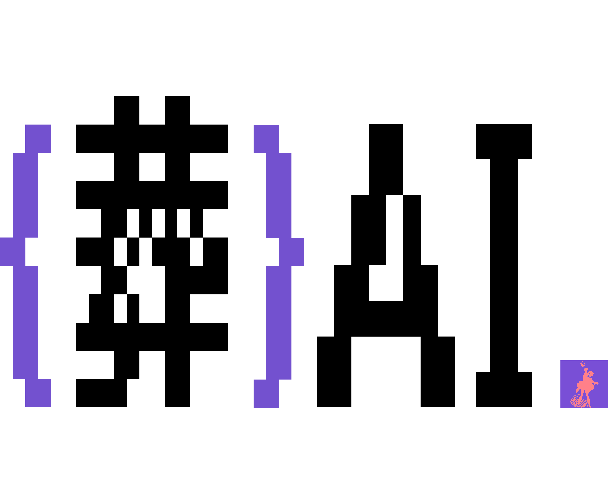

<p align="center">
  
</p>

<p align="center"><strong>吹牛逼可以，但你要有一个过得去的产品。</strong></p>

---

AI 产品结构化分析框架。给一个 URL、一份文件、或者一段融资稿，拆开来看它到底行不行。

**主要用法是 Claude Code / Codex 的 skill** — 装完直接 `/funeralai`，零 Python 依赖，复用你已有的 AI 编码环境。

## 安装

```bash
git clone https://github.com/FrichXi/funeralai.git
cd funeralai
./install.sh
```

脚本自动检测环境，装 Claude Code 和/或 Codex 的 skill。也可以单独装：`./scripts/install_claude.sh` 或 `./scripts/install_codex.sh`。

## 使用

```
/funeralai https://github.com/xxx/yyy        # GitHub 仓库
/funeralai https://example.com                # 网页 / 产品
/funeralai path/to/article.md                 # 本地文件
/funeralai                                    # 交互式，会问你要分析什么
```

支持：GitHub 仓库 URL · 网页 URL · 本地文件（.md / .txt / .pdf）· 粘贴文本

## 分析框架

四层拆解，判断完全基于提交的材料，不基于对公司的已有认知：

| 层级 | 问题 |
|------|------|
| 第零层（实查） | 代码/产品实际跑通了吗？ |
| 第一层 | 有人在用吗？是真需求还是补贴驱动？ |
| 第二层 | 长板有多长？用户会留下来吗？ |
| 第三层 | 吹的和做的差多远？ |

结论三档：**整挺好** · **吹牛逼呢** · **整不明白**

分析流水线不是一把梭让模型胡说八道，而是分三步：

1. **extract** — 结构化事实提取，不急着判断
2. **ask** — 追问一手体验（3 核心 + 最多 2 补充）
3. **parallel judge** — 4 路并行：广告检测 · 产品概述 · 证据抽取 · 核心结论

## 项目结构

```
.agents/skills/funeral/    共享核心（唯一事实源）
.claude/skills/funeral/    Claude Code 镜像（sync 脚本维护）
.codex/prompts/            Codex 包装层
scripts/                   安装与同步脚本
funeralai/                 Python 参考实现
```

## Python 参考实现

`funeralai/` 目录是原始 CLI 版本（`pip install funeralai`），独立仓库在 [funaral-cli](https://github.com/FrichXi/funaral-cli)。Skill 版本不依赖 Python，复用你已有的 AI 编码环境。Python 版保留用于对照分析质量和批量分析。

> PDF 读取依赖 pymupdf（AGPL-3.0），pip 安装时注意 license 兼容性。Skill 版本不受影响。

## 常见问题

**`/funeralai` 没出现？** — 检查 install.sh 是否执行成功，确认 skill 文件在对应平台目录。

**GitHub 分析需要什么？** — 装 [gh CLI](https://cli.github.com/)。

**网页抓取失败？** — 部分网站有反爬限制，分析器会要求你手动粘贴内容。

## 相关项目

- [funaral-cli](https://github.com/FrichXi/funaral-cli) — CLI / TUI 交互工具，`pip install funeralai`
- [funeralai-web4](https://github.com/FrichXi/funeralai-web4) — 知识图谱可视化站点 → [funeralai.cc](https://funeralai.cc)

## License

[MIT](LICENSE)
